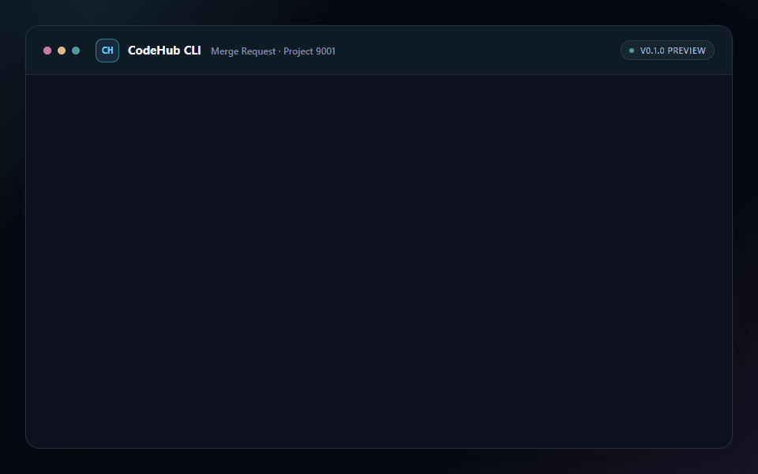

# CodeHub CLI

让开发者、AI Agent 与 CI 以一致、可脚本化的方式访问组织内部 CodeHub。

[](https://github.com/BlackLotusAL/CodeHubX/actions/workflows/ci.yml)
[](https://nodejs.org/)
[](LICENSE)

> [!WARNING]
> **内部预览（0.1.0）**
>
> CodeHub CLI 目前仅支持从源码安装，并仅承诺在 Windows 与 Linux 上运行。使用前需要接入组织内部网络，并准备 CodeHub、DevUC 的服务地址与 AppCode。当前命令、配置和输出契约仍可能变化；用于自动化时，请锁定经过验证的具体提交。



CodeHub CLI 将分散的 Project、Merge Request、Commit 与评论接口整理为一套可预测的命令行体验：自动化默认获得结构化 JSON，开发者也可以切换到适合阅读的彩色终端视图。登录凭据保存在操作系统凭据库中，不进入命令历史或配置文件。

## 环境要求

- Node.js 22 或更高版本
- Windows Credential Manager，或 Linux Secret Service（例如 GNOME Keyring/KWallet）
- 可访问组织内部 DevUC 与 CodeHub API 的网络环境
- 由组织提供的 DevUC、CodeHub 服务地址与 AppCode

## 从源码安装

```bash
git clone https://github.com/BlackLotusAL/CodeHubX.git
cd CodeHubX
npm ci
npm link
codehub --help
```

仓库名为 CodeHubX，安装后的产品与可执行命令分别为 **CodeHub CLI** 和 `codehub`。

## Quick Start

首先创建配置文件，并在终端输出中查看文件位置：

```bash
codehub config init --output human
```

用文本编辑器打开该文件，填写组织提供的地址和 AppCode：

```json
{
  "devuc": {
    "endpoint": "https://devuc.example.com",
    "appCode": "your-devuc-app-code"
  },
  "codehub": {
    "endpoint": "https://codehub.example.com",
    "appCode": "your-codehub-app-code"
  }
}
```

默认配置位置：

- Windows：`%APPDATA%\codehub\config.json`
- Linux：`$XDG_CONFIG_HOME/codehub/config.json`；未设置该变量时为 `~/.config/codehub/config.json`

然后在真实交互式终端中登录。向导支持 Private Token 和 DevUC 两种认证方式：

```bash
codehub auth login
```

最后，用实际的 Project ID 和 MR IID 查看 Merge Request：

```bash
codehub mr view 17 --project-id 9001 --output human
```

## AI Agent Skill

仓库提供开放 Agent Skills 格式的 [`codehub-cli` Skill](skills/codehub-cli/SKILL.md)，用于指导 AI Agent 安全、可靠地调用 CodeHub CLI。

先按上文安装 `codehub`，再将整个 `skills/codehub-cli` 目录复制或导入目标 Agent 支持的 Skill 目录。具体安装位置和调用方式以该 Agent 的文档为准。当前 Skill 仅随源码仓库提供，不包含在 npm 安装包中。

Skill 应与同一仓库修订版的 CLI 配套使用；升级 CLI 时也应同步更新 Skill。安装后的 Skill 名称为 `codehub-cli`。

## 核心命令

| 能力          | 命令                                                                                                                   | 说明                                  |
| ------------- | ---------------------------------------------------------------------------------------------------------------------- | ------------------------------------- |
| Project       | `codehub repo list <group-id>`                                                                                         | 列出 Group 中的 Project               |
| Project       | `codehub repo view <project-id>`                                                                                       | 查看 Project 详情                     |
| Merge Request | `codehub mr list --project-id <project-id> [--state open\|closed\|locked\|merged\|all]`                                | 列出 MR；默认只看 `open`              |
| Merge Request | `codehub mr view <iid> --project-id <project-id>`                                                                      | 查看 MR 详情                          |
| Commit        | `codehub mr commits <iid> --project-id <project-id>`                                                                   | 列出 MR 包含的 Commit                 |
| Discussion    | `codehub mr comment create <iid> --project-id <project-id> --body <text> [--severity suggestion\|minor\|major\|fatal]` | 创建 MR 评论；默认级别为 `suggestion` |

运行 `codehub <command> --help` 可查看命令参数。所有 ID 都必须是正整数字符串。

`repo list` 与 `mr list` 不会自行补充 API 未记录的分页参数，因此服务端返回的列表可能不是全量。

## 输出

默认输出为无额外信封的 JSON；在叶子命令后添加 `--output human` 可切换为适合人工阅读的终端视图。

```bash
codehub mr view 17 --project-id 9001
codehub mr view 17 --project-id 9001 --output human
```

## 开发与验证

```bash
npm ci
npm run check
npm test
npm run verify
```

`npm run verify` 会执行静态检查、四项不低于 90% 的覆盖率门禁，以及安装包烟测。

完整行为以 [产品需求文档](docs/PRD.md)、[API 接口清单](docs/API.md) 和 [验收报告](docs/ACCEPTANCE.md) 为准。

## License

CodeHub CLI 使用 [Apache License 2.0](LICENSE)。
