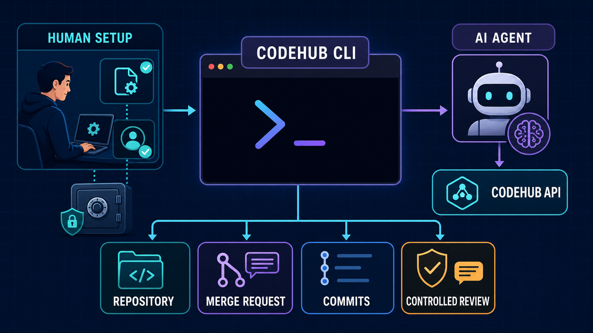

# CodeHub CLI

CodeHub CLI 旨在为 AI Agent、自动化脚本和开发者提供统一、安全、可预测的 CodeHub
命令行入口，让代码检视工作能够可靠接入自动化流程。



## 环境要求

- Node.js 22+
- Git 与已配置的 Git Credential Helper
- Linux 或 Windows（macOS 尽力兼容）

## 安装与开发

```bash
npm install
npm link
codehub version
```

运行完整检查：

```bash
npm run prepack
```

## 快速使用

### 1. 初始化服务配置

首次使用时运行：

```bash
codehub config init
```

CLI 会生成包含 `devuc.endpoint`、`devuc.appCode`、`codehub.endpoint` 和
`codehub.appCode` 的用户配置文件：

- Windows：`%APPDATA%\codehub\config.json`
- Linux：`$XDG_CONFIG_HOME/codehub/config.json`；未设置时使用
  `~/.config/codehub/config.json`

默认配置已填入当前服务信息。如需切换服务，由人类直接编辑该文件，然后重新登录。

### 2. 完成交互登录

由人类在 Windows PowerShell 或 Linux 终端中运行：

```bash
codehub auth login
```

使用 `↑` / `↓` 选择认证方式，按 `Enter` 确认，再根据提示输入相应信息。登录完成后，
AI Agent 即可执行其他命令。

### 3. 查看可用命令

| 命令 | 用途 |
| --- | --- |
| `codehub version` | 查看 CLI 与运行时版本 |
| `codehub capabilities` | 查看 CLI 支持的能力 |
| `codehub config init` | 初始化用户服务配置 |
| `codehub auth login` | 交互登录 |
| `codehub auth status` | 查看本地登录状态 |
| `codehub auth logout` | 退出登录 |
| `codehub repo list <group-id>` | 列出 Group 中的仓库 |
| `codehub repo view <project-id>` | 查看仓库 |
| `codehub mr list -R <project-id>` | 列出 Merge Request |
| `codehub mr view <iid> -R <project-id>` | 查看 Merge Request |
| `codehub mr commits <iid> -R <project-id>` | 查看 Merge Request 的提交 |
| `codehub mr comment create <iid> -R <project-id> ...` | 创建检视评论 |

运行 `codehub --help` 或 `codehub <命令> --help` 可查看完整参数。

常用全局选项：

| 选项 | 用途 |
| --- | --- |
| `--output <json\|human>` | 选择机器可读或人工可读输出 |
| `--request-id <id>` | 指定请求关联 ID |
| `--timeout <duration>` | 设置单次请求超时，例如 `30s` |
| `--no-input` | 禁止交互式提示 |
| `-R, --repo <project-id>` | 指定 Merge Request 所属 Project |

### 4. 使用示例

以下命令均可直接在 Windows PowerShell 或 Linux 终端中执行：

```bash
codehub auth status
codehub repo list 123 --output human
codehub repo view 456
codehub mr list -R 456 --output human
codehub mr view 17 -R 456
codehub mr commits 17 -R 456
codehub mr comment create 17 -R 456 --body-file review.md --severity major --confirm-write --dry-run
```

查询和写入命令默认输出两空格缩进的 JSON；人工查看时增加 `--output human`。失败时
stdout 保持为空，结构化错误写入 stderr。

成功与错误信封的 JSON Schema 位于 [`schemas/`](./schemas)。完整产品边界见
[`docs/PRD.md`](./docs/PRD.md)。
